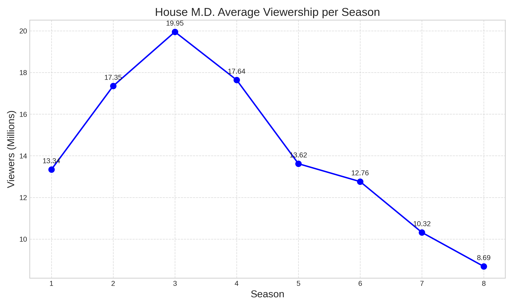
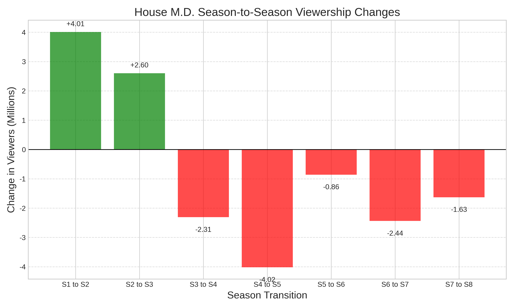

## 1. Introduction

*House M.D.* (often referred to simply as *House*) is an American medical drama television series that originally aired on the Fox network for eight seasons, from November 16, 2004, to May 21, 2012. The series was created by David Shore and stars Hugh Laurie as the titular character, Dr. Gregory House. Dr. House is an unconventional, misanthropic, and cynical medical genius who leads a team of diagnosticians at the fictional Princeton–Plainsboro Teaching Hospital in New Jersey, despite his dependence on pain medication [1].

{width="300"}

## 2. Basic Statistics

The show was incredibly successful, ranking among the top 10 series in the United States from its second through fourth seasons. It was even the most-watched television program in the world in 2008 [1].

Here is a summary of the average viewership per season in the U.S. television market [1]:

| Season | Episodes | Premiere Date | Finale Date | Viewers (millions) | Rank |
|:------:|:--------:|:-------------:|:-----------:|:------------------:|:----:|
| 1      | 22       | Nov 16, 2004  | May 24, 2005| 13.34              | #24  |
| 2      | 24       | Sep 13, 2005  | May 23, 2006| 17.35              | #10  |
| 3      | 24       | Sep 5, 2006   | May 29, 2007| 19.95              | #5   |
| 4      | 16       | Sep 25, 2007  | May 19, 2008| 17.64              | #7   |
| 5      | 24       | Sep 16, 2008  | May 11, 2009| 13.62              | #16  |
| 6      | 22       | Sep 21, 2009  | May 17, 2010| 12.76              | #22  |
| 7      | 23       | Sep 20, 2010  | May 23, 2011| 10.32              | #42  |
| 8      | 22       | Oct 3, 2011   | May 21, 2012| 8.69               | #58  |

## 3. Viewership Over Time

The following graph illustrates the average number of viewers (in millions) for each season of *House M.D.*

## 4. Season-to-Season Changes

To better understand the trend, we can look at the episode-to-episode (or season-to-season) changes in viewership.

## 5. Analysis of Observed Changes

Based on the data, *House M.D.* experienced a significant rise in popularity during its early years. The viewership increased by **4.01 million** between Season 1 and Season 2, and further grew to reach its peak in Season 3 with an average of **19.95 million** viewers. 

However, after Season 3, the show saw a steady decline in its audience. A notable drop occurred between Season 4 and Season 5, where the viewership decreased by **-4.02 million**. This downward trend continued until the final season (Season 8), which recorded the lowest average viewership of the series at **8.69 million**. The overall decrease in viewership between the peak (Season 3) and the final season (Season 8) was a staggering **11.26 million** viewers.

> Note: The data used in this report was collected from the Wikipedia page for *House (TV series)* [1]. AI assistance was used to generate the Python code for data visualization and to structure this Quarto document.

## References

[1] Wikipedia contributors. "House (TV series)." Wikipedia, The Free Encyclopedia. Available at: [https://en.wikipedia.org/wiki/House_(TV_series)](https://en.wikipedia.org/wiki/House_(TV_series))
series))
